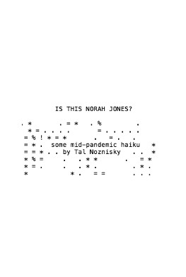
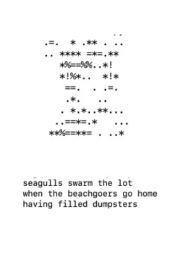
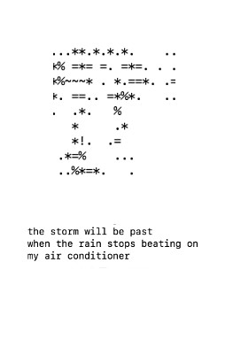
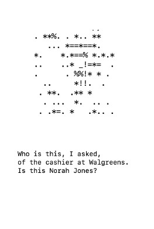
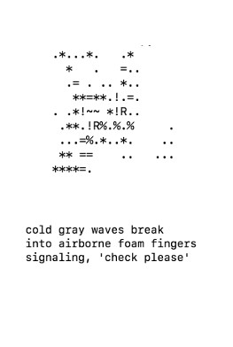

This is the raw material of a lil zine of some haikus I wrote during late summer and early fall of 2020.

The graphic accompaniments are graphic representations of the haikus. Each haiku hashed into a code the describes the file's data. Another algorithm then uses that code as the sequence for a new drawing. Each haiku's drawing is unique and distinct. 

Here's a [nice summary](https://blog.benjojo.co.uk/post/ssh-randomart-how-does-it-work-art) of the image-making algorithm.

And here's the zine:

