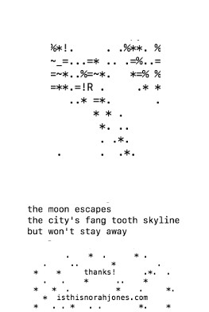

This is the raw material of a lil zine of some haikus I wrote during late summer and early fall of 2020.

A graphic interpretation accompanies each haiku. Each haiku is hashed (i.e. scrambled into a computer-readable interpretation of the data) and then passed to a graphic generator script. 

Here's a [nice summary](https://blog.benjojo.co.uk/post/ssh-randomart-how-does-it-work-art) of the image-making algorithm.

And here's the zine:

