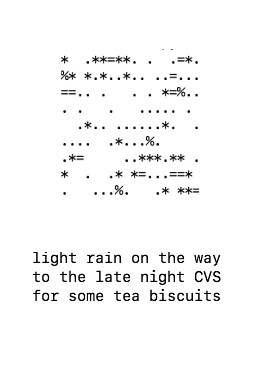

This is the raw material of a lil zine of some haikus I wrote during late summer and early fall of 2020. They are all accompanied by computer-generated drawings. 

And, in a way, these drawings are graphic representations of the haikus.

Each haiku gets its own file and each file gets turned into a hash. The hash is a alphanumeric (plus other punctuation) sequence that describes the file's data. 

Another algorithm then takes that sequence as instructions for a new drawing. It takes these instructions very seriously and will produce the same unique and distinct drawing of the haiku file's data every time you run it.

Here's a [nice summary](https://blog.benjojo.co.uk/post/ssh-randomart-how-does-it-work-art) of the image-making algorithm.

And here's the zine:

